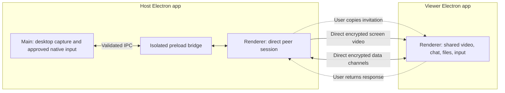
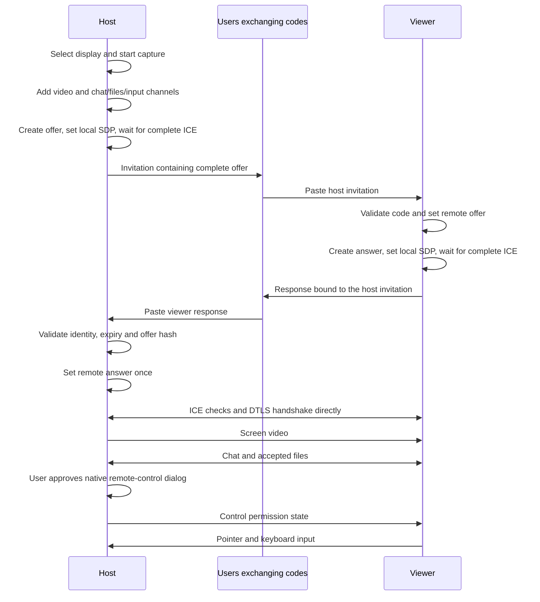

# WiiUltraConnect Direct — zero external services

This is the architecture for **0.2.0-serverless.1** on `codex/serverless-direct`. The original signaling-based version remains on `main`.



There is no application signaling listener, relay, address-discovery service, account service, bootstrap endpoint or automatic external fallback. Runtime `RTCPeerConnection` configuration is generated by a fixed function with `iceServers: []`. Legacy server-related environment variables are ignored. Renderer CSP permits Blob access but no HTTP/HTTPS/WebSocket connection endpoints. ICE's peer-to-peer connectivity checks still use STUN protocol messages between the two peers; this is not a separate STUN service.

## Setup sequence



The host is the only offerer, and a session contains one host and one viewer. Full SDP is exchanged only after `iceGatheringState` becomes `complete`; no later trickle candidates need delivery. Gathering has a 15-second cancellation-aware timeout. The host's manual waiting stage has the invitation's ten-minute lifetime, and applying an answer starts a 30-second connection deadline. Browser ICE checks can fail before the code lifetime, especially if the viewer delays returning its response. A failed session must regenerate codes.

## Code validation and session lifetime

The `WUC-DIRECT-1.` prefix is followed by base64url UTF-8 JSON:

```js
{
  version: 1,
  kind: 'offer', // or 'answer'
  sessionId: '<random UUID>',
  issuedAt: 1800000000000,
  expiresAt: 1800000600000,
  description: { type: 'offer', sdp: '<complete local SDP>' }
  // answer also includes offerHash: '<SHA-256 hex>'
}
```

Code size, schema, role, UUID, lifetime, complete SHA-256 certificate fingerprint, ICE credentials and candidate presence are checked before native SDP parsing. Declared relay candidates are rejected. A viewer response must match the host's session ID, original timestamps and SHA-256 digest of the exact original offer. A host accepts its response once, and concurrent apply attempts are rejected. A malformed response leaves a waiting host invitation available for correction.

The code is not an encrypted envelope or an authenticated user identity. The manual exchange must be trusted. DTLS/SRTP encrypts the peer transport using fingerprints carried in that exchange. Session closure aborts pending gathering, expires code state, releases capture tracks, closes data channels, cancels transfers and revokes input. The invitation expiry timer is removed when the peers connect, so an established session does not end at ten minutes.

## Screen, chat, file and input pipeline

The display-capture and native-permission boundaries are unchanged from the original edition. Main lists screens with `desktopCapturer`, validates IPC sender/frame identity, and grants the locally selected screen to `getDisplayMedia`. Capture has 30/60 FPS and 1080p limits. The sender prioritizes frame rate with `degradationPreference: 'maintain-framerate'` and a 2/4/8 Mbps budget. Reported RTT is ICE candidate-pair round-trip time, not glass-to-glass latency.

Three ordered reliable data channels carry chat, files and input. Chat uses bounded JSON and text-only rendering. Files use explicit acceptance, 16 KiB binary payloads, UUID/offset framing, 256/64 KiB backpressure watermarks, exact reassembly-size checks, cancellation and receiver acknowledgements. They share network congestion control with video.

Pointer positions are normalized relative to the image inside the video element, excluding letterbox bars, then mapped to the captured monitor. Main's nut.js controller serializes key/button operations, rejects unrecognized events and invalid coordinates, and invalidates queued work when consent is revoked. Remote input remains disabled until the host approves a native dialog and the emergency shortcut is registered. Channel loss revokes input immediately; other session resources are torn down on disconnect/failure.

## Network limits

This version can use only addresses and connectivity available directly to the endpoints. Global IPv6 or directly assigned public IPv4 can enable internet reachability if host firewalls and routing allow the selected peer ports. Private-address candidates are not inherently reachable from unrelated networks. There is no public-IP lookup, router configuration, NAT mapping discovery, hole-punch coordinator, or relay fallback. Local success does not prove two arbitrary internet networks can connect.

## References

- [WebRTC peer connections and ICE](https://webrtc.org/getting-started/peer-connections) — signaling and NAT traversal roles.
- [Electron desktop capture](https://www.electronjs.org/docs/latest/api/desktop-capturer/) — display sources and capture permissions.
- [Electron security](https://www.electronjs.org/docs/latest/tutorial/security) — sandbox, context isolation and IPC validation.
- [WebRTC data-channel buffering](https://developer.mozilla.org/en-US/docs/Web/API/RTCDataChannel/bufferedAmountLowThreshold) — backpressure notifications.
