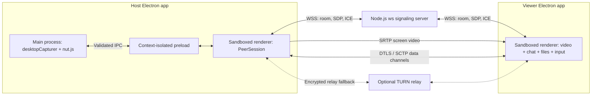
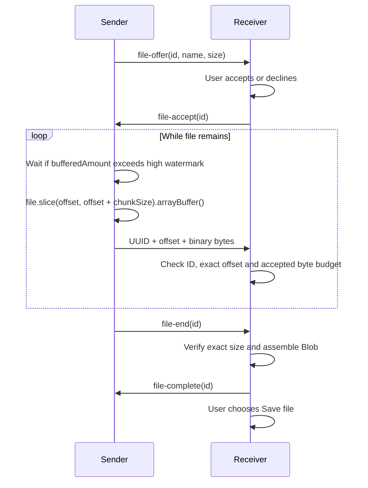

# WiiUltraConnect — architecture and implementation

## 1. Architectural foundation and signaling



The host owns capture and is the sole SDP offerer. The viewer answers. Restricting each room to these two roles avoids offer glare without introducing a generalized perfect-negotiation state machine. The signaling service never transports application video, chat, input or file payloads. It does see room secrets, SDP and candidate metadata. Peer transport is direct when ICE permits it; a configured TURN server relays encrypted traffic when required.

[`server/signaling.mjs`](../server/signaling.mjs) exports a server factory, while `server/index.mjs` supplies environment-based startup. It generates a 48-bit room ID and an independent 192-bit invitation secret with Node crypto. Join validates that secret using equal-length, constant-time comparison. Rooms are routed by socket membership, not client-provided recipient identifiers. Role-specific validation permits only host offers, viewer answers and bounded ICE objects.

| Message | Direction | Payload |
| --- | --- | --- |
| `create` | Host → server | None |
| `created` | Server → host | `roomId`, `invitation`, `role` |
| `join` | Viewer → server | `roomId`, `secret` |
| `joined` | Server → viewer | `roomId`, `role` |
| `peer-ready` | Server → host | Triggers peer creation and offer |
| `offer` / `answer` | Peer → server → other peer | `description: { type, sdp }` |
| `ice` | Peer → server → other peer | Serialized `RTCIceCandidate` |
| `leave` | Peer → server | Invalidates room |
| `peer-left` | Server → remaining peer | Stops session and capture |
| `error` | Server → peer | Bounded error code |

```mermaid
sequenceDiagram
  participant H as Host
  participant S as Signaling
  participant V as Viewer
  H->>H: Select display and start capture
  H->>S: create
  S->>H: created + private invitation
  Note over H,V: Host shares invitation out of band
  V->>S: join(roomId, secret)
  S->>V: joined
  S->>H: peer-ready
  H->>S: offer
  S->>V: offer
  V->>S: answer
  S->>H: answer
  H->>S: ICE candidates
  S->>V: ICE candidates
  V->>S: ICE candidates
  S->>H: ICE candidates
  Note over H,V: ICE may arrive before SDP; receiver queues candidates
  H->>V: Screen video
  H->>V: Chat, files, control permission
  V->>H: Chat, files, permitted input
```

Heartbeat ping/pong removes dead sockets. Rate and payload limits bound ordinary connection abuse; a public gateway still needs per-IP and user admission limits. Every peer departure deletes its room, preventing stale invitations from silently admitting replacement viewers. A lost signaling connection intentionally ends the peer session even if media could temporarily survive independently.

## 2. Screen capture and WebRTC pipeline

[`electron/main.cjs`](../electron/main.cjs) lists screens using `desktopCapturer.getSources`. A local display selection arms `setDisplayMediaRequestHandler`; only the app's exact main frame can request the chosen source. [`src/app.js`](../src/app.js) calls `navigator.mediaDevices.getDisplayMedia` without audio and tells main when the granted capture has started. A sandboxed renderer never imports Electron or a native input package directly.

The capture request uses **ideal** constraints; `getDisplayMedia` does not accept the same mandatory capture selection constraints as older Electron examples. Once the track exists, `applyConstraints` caps it to 30/60 FPS and 1920×1080. `contentHint = 'motion'` suggests motion handling. Permission failures and unavailable displays are shown in the app; a constraint failure preserves the stream with a visible notice.

[`src/peer.js`](../src/peer.js) adds the video track before the host's offer and receives it through `ontrack` at the viewer. It applies sender parameters after connection:

```js
parameters.degradationPreference = 'maintain-framerate';
parameters.encodings[0].maxBitrate = bitrateMbps * 1_000_000;
parameters.encodings[0].maxFramerate = targetFps;
parameters.encodings[0].priority = 'high';
parameters.encodings[0].networkPriority = 'high';
await sender.setParameters(parameters);
```

These are bandwidth and adaptation hints, not an FPS or end-to-end latency guarantee. The stack negotiates its supported codecs; it does not rewrite SDP or force an unavailable encoder. There is no application video buffering. ICE candidates received before the remote description are queued (maximum 256), then flushed. Signaling handlers execute serially, preventing concurrent SDP changes. Connection setup times out after 30 seconds; a transient disconnect gets eight seconds to recover, but input consent is revoked immediately.

The displayed FPS is an RTP statistic when available. The displayed millisecond number is candidate-pair round-trip time, **not** measured glass-to-glass latency. `getStats()` identifies direct versus relayed candidates. Closing the app, ending the session or a stopped capture track tears down tracks, timers, channels and room membership.

## 3. P2P chat and chunked file transfer

The host creates three ordered, reliable `RTCDataChannel`s: `chat`, `files` and `input`. Separate channels allow small interactive messages to be scheduled separately, while all still share congestion control and the network.

Chat is `{ type: 'chat', text }`, capped at 4,000 characters with outbound buffering and inbound rate limits. The renderer builds messages with `textContent`; a peer's HTML remains text. The latest 200 messages remain in the DOM.

[`src/file-transfer.js`](../src/file-transfer.js) uses this protocol:



- Each binary packet has a 16-byte UUID, a 4-byte big-endian byte offset and at most 16 KiB of payload. Payload size also respects negotiated `pc.sctp.maxMessageSize`.
- Sender pauses above 256 KiB buffered data and resumes at/below 64 KiB using `bufferedamountlow`. Listener registration includes an immediate state recheck to avoid a missed drain event. Abort, close, error and 60-second timeout all reject the pending wait and remove listeners.
- Metadata is validated before any allocation; the receiver allows a maximum 128 MiB declared size, one incoming transfer and one outgoing transfer. Empty files work. Filename paths and control characters are stripped, and a peer cannot specify a local filesystem destination.
- Exact offsets and byte counts reject gaps, duplication and overflow. The reliable transport supplies delivery and integrity protection. A separate application checksum is not in the wire protocol; the integration test independently compares SHA-256 to verify implementation correctness.
- Offers require user acceptance. No binary data is sent before acceptance. Cancellation and disconnect discard partial chunks. Old packets already queued for a cancelled UUID are ignored. There is no automatic retry or partial resume.
- Progress differentiates sending, waiting for receipt, received and delivered. Sender completion depends on the receiver acknowledgement, not merely queuing the last bytes. Receiver save is a separate action.

## 4. Remote input control

[`src/viewer-input.js`](../src/viewer-input.js) computes the actual image rectangle inside an `object-fit: contain` video, subtracting letterbox offsets before normalization:

```text
scale = min(elementWidth / videoWidth, elementHeight / videoHeight)
imageWidth = videoWidth × scale
imageHeight = videoHeight × scale
x = (pointerX - elementLeft - horizontalLetterbox) / imageWidth
y = (pointerY - elementTop - verticalLetterbox) / imageHeight
```

Clicks in letterbox bars are ignored. Pointer capture keeps drag releases flowing outside the video and clamps dragged coordinates to `[0,1]`. Pointer moves coalesce to animation frames; button events flush any pending move first, preserving order. Keyboard input is sent only while the shared video has focus. Blur, visibility loss and pointer cancellation send a release-all message.

Input messages contain a small allowlisted vocabulary:

```js
{ type: 'pointer', action: 'move', x: 0.5, y: 0.5 }
{ type: 'pointer', action: 'down', x: 0.5, y: 0.5, button: 0 }
{ type: 'key', action: 'down', code: 'ControlLeft' }
{ type: 'key', action: 'up', code: 'ControlLeft' }
{ type: 'wheel', dy: 100 }
{ type: 'release' }
```

The host starts in view-only mode. Its **Allow remote control** button opens a native confirmation dialog; the renderer cannot grant itself permission by receiving a peer packet. Main requires an active locally granted capture, maps the captured display ID to display bounds, verifies Accessibility on macOS and registers the emergency shortcut. Failure to register the shortcut leaves control disabled.

[`electron/input-controller.cjs`](../electron/input-controller.cjs) validates input again in main, maps browser key codes to known nut.js enums, and serializes asynchronous native operations. It calls `mouse.setPosition(new Point(...))`, separate `pressButton`/`releaseButton`, `keyboard.pressKey`/`releaseKey`, and bounded scroll methods. There are no shell commands or dynamically selected native methods from peer data.

Revocation changes a generation counter synchronously. Already queued operations check that counter before execution; an in-flight pointer move checks it again before pressing a button. Held keys/buttons are tracked and released after in-flight native work completes. Queue overflow disables control. A watchdog releases stale held input, and display changes require renewed consent. The viewer receives a `control-state` message reflecting host permission, but native main-process state is the final gate.

## API references

- [Electron desktopCapturer](https://www.electronjs.org/docs/latest/api/desktop-capturer/) and [display media request handler](https://www.electronjs.org/docs/latest/api/session#sessetdisplaymediarequesthandlerhandler-opts) — capture and source selection.
- [Electron security guidance](https://www.electronjs.org/docs/latest/tutorial/security) — context isolation, sandboxing, narrow preload methods and sender validation.
- [ws server API](https://github.com/websockets/ws/blob/master/doc/ws.md) — WebSocket server limits and lifecycle.
- [WebRTC data channel buffering](https://developer.mozilla.org/en-US/docs/Web/API/RTCDataChannel/bufferedAmountLowThreshold) and [message size guidance](https://developer.mozilla.org/en-US/docs/Web/API/WebRTC_API/Using_data_channels) — backpressure and moderate packet sizes.
- [nut.js mouse](https://nutjs.dev/docs/mouse), [keyboard](https://nutjs.dev/docs/keyboard) and [installation](https://nutjs.dev/docs/installation) — native operations and platform requirements.
